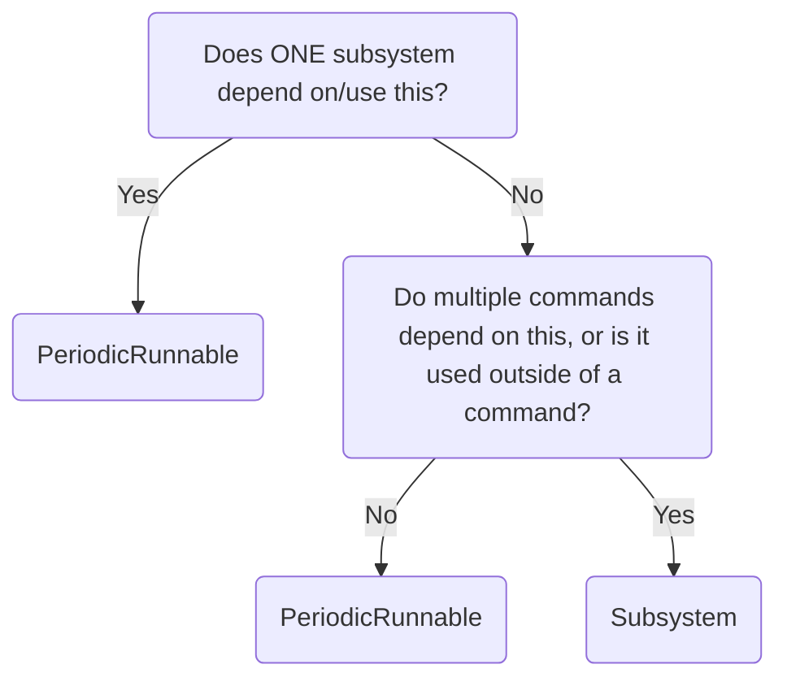

# PeriodicRunnable class
## Decision flowchart


## Code example
```java
class Example extends PeriodicRunnable{
  public Example(){
    super(); // Super call adds it to the registry, which calls the periodic method every tick
  }
  @Override
  public void periodic(){
    //Periodic functionality
  }
}
```