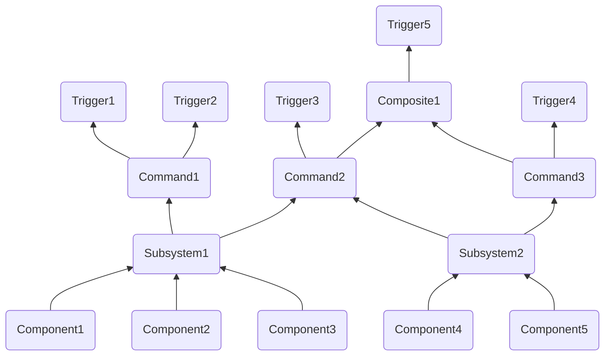

# Command Base Teaching Document

## Table of Contents:

1. [Commmand Concepts Overview](#command-concepts-overview)
2. [How to make a...](#how-to-make-a)
    1. [Subsystem](#subsystem)
    2. [Command](#command)
    3. [Button Binding](#button-binding)
3. [Adding Additional Functionality at Binding with Decorators]()
4. [Logical Operators for Bindings](#logical-operators-for-bindings)
5. [Lambda use for Live Updating of Input]()
6. [Default Commands for Subsystems](#default-commands-for-subsystems)
7. [Autonomous](#autonomous)
8. [Example Solenoid Subsystem and Command](#example-solenoid-subsystem-and-command)

## Command Concepts Overview:

- A **component** is a single device on the robot
    - Accessible via a class either built into wpilib or a [3rd party vendor library](wpilib_reference#3rd-party-vendor-libraries) (not user-defined)
    - Lowest level concept we work with
    - Examples: `TalonFX` (and other motors), double solenoid, limit switch
- A **subsystem** is a group of components on the robot
    - The only way to access a component from the rest of the code
        - Must contain all functionality needed to interface with its components
    - Each component is contained in exactly **one** subsystem
        - Otherwise, the built-in protection against multiple commands being scheduled for one subsystem at once will not properly protect the component from recieving multiple values simultaneously (this is handled by [command requirements](https://docs.wpilib.org/en/stable/docs/software/commandbased/commands.html#getrequirements))
    - No components in a subsystem should need to do different tasks at the same time
        - A subsystem can't run multiple commands at once, so even if two tasks (such as shooting vs. intaking) require different components and won't interfere, you will need to combine the tasks into the same command or break your subsystem into multiple pieces
        - For example: if you have your drivetrain in the same subsystem as your shooter, you can't drive and shoot at once. You should instead separate the shooter and drivetrain into separate subsystems.
    - [DOCS](https://docs.wpilib.org/en/stable/docs/software/commandbased/subsystems.html)
    - Examples: a drivetrain, a shooter, an intake
- A **command** does a task
    - The only way to use subsystems
        - User input (bindings) is abstracted into actions (commands) for the robot to do using its various subsystems
    - Handled by the [Command Scheduler](https://docs.wpilib.org/en/stable/docs/software/commandbased/command-scheduler.html), which determines what commands are running when through a system of scheduling a command when a binding is pressed and descheduling it when it completes or is interrupted
    - Commands have a list of [requirements](https://docs.wpilib.org/en/stable/docs/software/commandbased/commands.html#getrequirements), which are the subsystems that it uses
        - Each subsystem can be required by multiple commands
        - WPILib prevents conflicts, ensuring that a subsystem doesn't try to do two things at once
        - If a command that requires a subsystem that's currently being used is scheduled, the command currently using the subsystem will be *interrupted* to free up the subsystem
        - You can detect if your command was ended due to an interruption using the boolean `interrupted` parameter on the command's `end()` method 
        - You can make a command [non-interruptible](https://docs.wpilib.org/en/stable/docs/software/commandbased/commands.html#getinterruptionbehavior), meaning that a command with a shared requirement being scheduled won't interrupt it
    - Commands can be formed out of other commands by command grouping, these commands are called compositions
        - There are several different types of composition to control the order that the composed commands are run in, read more [here](https://docs.wpilib.org/en/stable/docs/software/commandbased/command-compositions.html)
        - As composites are commands, they can be used in the formation of more composites
    - [DOCS](https://docs.wpilib.org/en/stable/docs/software/commandbased/commands.html)
    - Examples: drive, shoot out a ring, take in a ring
- A **trigger** is an input that interacts with the command scheduler to control when commands are scheduled and descheduled
    - The most common type of trigger is a button input
        - These can be formed by declaring a `CommandXboxController` and calling a button method (`a()`, `b()`, `y()`) to declare which input to use, then a binding (`OnTrue()`, `WhileTrue()`) to declare what logic to use
        - Ex: `myCommandXboxController.a().onTrue([CommandPtrToBind]))`
    - Commands are generally bound to triggers in the `configureButtonBindings()` method of `RobotContainer`
    - Alternatively, you can make [arbitrary triggers](https://docs.wpilib.org/en/stable/docs/software/commandbased/binding-commands-to-triggers.html#arbitrary-triggers), which, rather than being a button input, take a boolean lambda that you provide
        - Example: `new Trigger(() -> { return controller.getA(); });`

    //I GOT HERE!!!
    - There are different [bindings](https://docs.wpilib.org/en/stable/docs/software/commandbased/binding-commands-to-triggers.html#trigger-bindings) available, which allow for different logical connections between triggers and commands
        - First, you make a trigger (such as a button), then call a binding on it, then place your command in the form of a `CommandPtr` as the argument for the binding
    - Triggers can be [composed](https://docs.wpilib.org/en/stable/docs/software/commandbased/binding-commands-to-triggers.html#composing-triggers) so that `&&`, `||`, or `!` can be applied to them
    - Bindings return the original trigger, so you can [chain together bindings](https://docs.wpilib.org/en/stable/docs/software/commandbased/binding-commands-to-triggers.html#chaining-calls)
    - [DOCS](https://docs.wpilib.org/en/stable/docs/software/commandbased/binding-commands-to-triggers.html)

