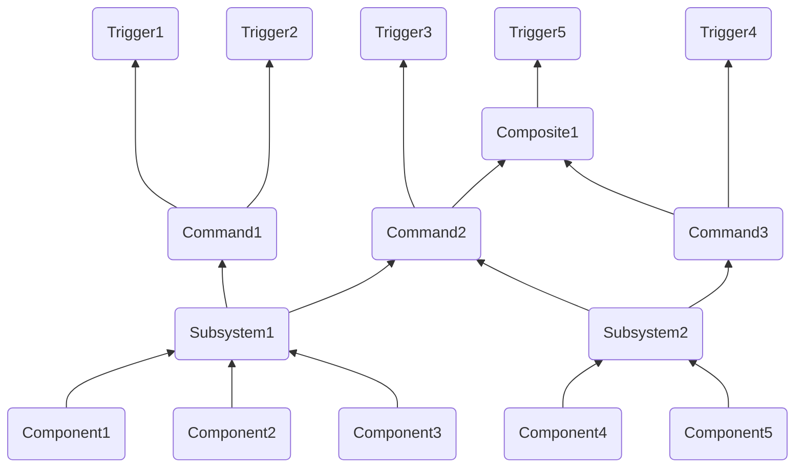

# Command Base Teaching Document

## Table of Contents:

1. [Commmand Concepts Overview](#command-concepts-overview)
2. [How to make a...](#how-to-make-a)
    1. [Subsystem](#subsystem)
    2. [Command](#command)
    3. [Button Binding](#button-binding)
3. [Adding Additional Functionality at Binding with Decorators]()
4. [Logical Operators for Bindings](#logical-operators-for-bindings)
5. [Lambda use for Live Updating of Input]()
6. [Default Commands for Subsystems](#default-commands-for-subsystems)
7. [Autonomous](#autonomous)
8. [Example Solenoid Subsystem and Command](#example-solenoid-subsystem-and-command)

## Command Concepts Overview:

- A **component** is a single device on the robot
    - Accessible via a class either built into wpilib or a [3rd party vendor library](wpilib_reference#3rd-party-vendor-libraries) (not user-defined)
    - Lowest level concept we work with
    - Examples: `TalonFX` (and other motors), double solenoid, limit switch
- A **subsystem** is a group of components on the robot
    - The only way to access a component from the rest of the code
        - Must contain all functionality needed to interface with its components
    - Each component is contained in exactly **one** subsystem
        - Otherwise, the built-in protection against multiple commands being scheduled for one subsystem at once will not properly protect the component from recieving multiple values simultaneously (this is handled by [command requirements](https://docs.wpilib.org/en/stable/docs/software/commandbased/commands.html#getrequirements))
    - No components in a subsystem should need to do different tasks at the same time
        - A subsystem can't run multiple commands at once, so even if two tasks (such as shooting vs. intaking) require different components and won't interfere, you will need to combine the tasks into the same command or break your subsystem into multiple pieces
        - For example: if you have your drivetrain in the same subsystem as your shooter, you can't drive and shoot at once. You should instead separate the shooter and drivetrain into separate subsystems.
    - [DOCS](https://docs.wpilib.org/en/stable/docs/software/commandbased/subsystems.html)
    - Examples: a drivetrain, a shooter, an intake
- A **command** does a task
    - The only way to use subsystems
        - User input (bindings) is abstracted into actions (commands) for the robot to do using its various subsystems
    - Handled by the [Command Scheduler](https://docs.wpilib.org/en/stable/docs/software/commandbased/command-scheduler.html), which determines what commands are running when through a system of scheduling a command when a binding is pressed and descheduling it when it completes or is interrupted
    - Commands have a list of [requirements](https://docs.wpilib.org/en/stable/docs/software/commandbased/commands.html#getrequirements), which are the subsystems that it uses
        - Each subsystem can be required by multiple commands
        - WPILib prevents conflicts, ensuring that a subsystem doesn't try to do two things at once
        - If a command that requires a subsystem that's currently being used is scheduled, the command currently using the subsystem will be *interrupted* to free up the subsystem
        - You can detect if your command was ended due to an interruption using the boolean `interrupted` parameter on the command's `end()` method 
        - You can make a command [non-interruptible](https://docs.wpilib.org/en/stable/docs/software/commandbased/commands.html#getinterruptionbehavior), meaning that a command with a shared requirement being scheduled won't interrupt it
    - Commands can be formed out of other commands by command grouping, these commands are called compositions
        - There are several different types of composition to control the order that the composed commands are run in, read more [here](https://docs.wpilib.org/en/stable/docs/software/commandbased/command-compositions.html)
        - As composites are commands, they can be used in the formation of more composites
    - [DOCS](https://docs.wpilib.org/en/stable/docs/software/commandbased/commands.html)
    - Examples: drive, shoot out a ring, take in a ring
- A **trigger** is an input that interacts with the command scheduler to control when commands are scheduled and descheduled
    - The most common type of trigger is a button input
        - These can be formed by declaring a `CommandXboxController` and calling a button method (`a()`, `b()`, `y()`) to declare which input to use, then a binding (`OnTrue()`, `WhileTrue()`) to declare what logic to use
        - Ex: `myCommandXboxController.a().onTrue([CommandPtrToBind]))`
    - Commands are generally bound to triggers in the `configureButtonBindings()` method of `RobotContainer`
    - Alternatively, you can make [arbitrary triggers](https://docs.wpilib.org/en/stable/docs/software/commandbased/binding-commands-to-triggers.html#arbitrary-triggers), which, rather than being a button input, take a boolean lambda that you provide
        - Example: `new Trigger(() -> { return controller.getA(); });`
    - There are different [bindings](https://docs.wpilib.org/en/stable/docs/software/commandbased/binding-commands-to-triggers.html#trigger-bindings) available, which allow for different logical connections between triggers and commands
        - First, you make a trigger (such as a button), then call a binding on it and pass in a new instance of your command
    - Triggers can be [composed](https://docs.wpilib.org/en/stable/docs/software/commandbased/binding-commands-to-triggers.html#composing-triggers), allowing you to apply logical operators to trigger using the `and()`, `or()`, and `negate()` methods
    - Bindings return the original trigger, so you can [chain together binding calls](https://docs.wpilib.org/en/stable/docs/software/commandbased/binding-commands-to-triggers.html#chaining-calls)
    - [DOCS](https://docs.wpilib.org/en/stable/docs/software/commandbased/binding-commands-to-triggers.html)

Here is an example of a possible structure for your project to show how these concepts work together:



## How to make a...

The following section covers how to write a new subsytem and command, and how to bind a command to a trigger. All file paths are in the `src > main > java > frc > robot` directory.

### Subsystem:

1. Create a file for your subsystem in `subsystems/SubsystemName.java` (from now on, `SubsystemName` represents the name of your subsystem)

2. In `SubsystemName.java`, define methods and components:
```java
import edu.wpi.first.wpilibj2.command.SubsystemBase;
import com.ctre.phoenix.motorcontrol.can.TalonFX;
import com.revrobotics.CANSparkMax;
import com.revrobotics.CANSparkLowLevel.MotorType;

public class SubsystemName extends SubsystemBase {
    //subsystem components such as motors:
    private final TalonFX exampleTalonFX = new TalonFX(0);
    private final CANSparkMax exampleSparkMax = new CANSparkMax(1, CANSparkLowLevel.MotorType.kBrushless);

    //Constructor
    public SubsytemName() {}

    //Custom methods go here:
    public void ExampleMethod1() {
        exampleTalonFX.Set(0.5);
    }

    public void ExampleMethod2(double exampleParameter) {
        exampleSparkMax.Set(exampleParameter);
    }
}
```

3. In `RobotContainer.java`, declare your subsystem:
```java
import frc.robot.subsystems.SubsystemName; //import your subsystem

public class RobotContainer {
    //create an instance of you subsystem at the top of the class (above the RobotContainer constructor)
    private final SubsytemName subsytemName = new SubsytemName();
}
```

### Command:

1. Create a file for your command in `commands/CommandName.java` (from now on, `CommandName` represents the name of your command)

2. In `CommandName.java`, declare the constructor and methods you plan to use:
```java
import edu.wpi.first.wpilibj2.command.CommandBase;

import frc.robot.subsystems.SubsytemName.java; //Subsystem requirement

public class CommandName extends CommandBase {
    SubsytemName subsytemName;
	
	//constructor, it must take all required subsystems as parameters
    public CommandName(SubsytemName subsystem)  {
		subsytemName = subsystem;

		addRequirements(subsystem); //subsystems must be added to the command's requirements
	}

	//you must override initialize(), execute(), end(), and isFinished()
	//Called once at the beginning
	@Override
    public void initialize() {
		subsystemName.ExampleMethod1();
		subsystemName.ExampleMethod2(0.5);
	}

	//Called every frame that the command is scheduled
  	@Override
    public void execute() {
		subsytemName.ExampleMethod1();
	}

	//Called once at the end, `interrupted` parameter tells whether the commmand was ended due to an interruption
	@Override
    public void end(boolean interrupted) {
		subsytemName.ExampleMethod2(0);
	}
  
	//return true when the command has completed, run once per frame that the command is scheduled, defaults to false (no end until interrupted)
	@Override
    public boolean isFinished() {
		return false;
	}

}
```

### Button Binding:

1. Create a private `CommandXboxController` in `RobotContainer.java` (import `edu.wpi.first.wpilibj2.command.button.CommandXboxController`)

2. In the `private void configureButtonBindings()` method in `RobotContainer.java`, bind your buttons; read the [docs](https://docs.wpilib.org/en/stable/docs/software/commandbased/binding-commands-to-triggers.html#trigger-bindings) to find the correct binding for the functionality you want to achieve
```java
import edu.wpi.first.wpilibj2.command.button.CommandXboxController;

import frc.robot.subsystems.SubsystemName;
import frc.robot.commands.CommandName;
import frc.robot.commands.Command2Name;

public class RobotContainer {
	private final SubsytemName subsytemName = new SubsytemName();
	private final CommandXboxController controller = new CommandXboxController(0);

	public RobotContainer() {
		configureButtonBindings();
	}

	private void configureButtonBindings() {
		//create a trigger by calling the method named for the button you want on the controller, then call a binding on that (such as `whileTrue()`, which schedules the command when you hit the button and deschedules it when you release it). The binding takes your command, which you can declare inline using your subsystem.
		controller.a().whileTrue(CommandName(subsystemName));

		//bindings return the original trigger, so bindings can be chained together
		controller.b()
			.onTrue(CommandName(subsystemName))
			.whileTrue(Command2Name(subsystemName));

		//trigger composition, which allows for the use of logical operators with triggers. Here, if neither are pressed, the command `CommandName` will be scheduled.
		controller.x().or(controller.y()).whileFalse(CommandName(subsystemName));
	}
}
```

